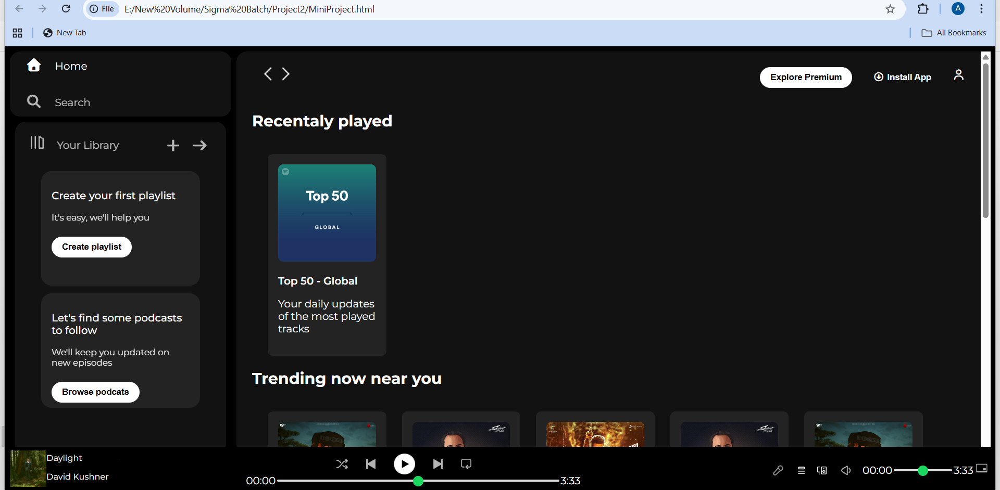
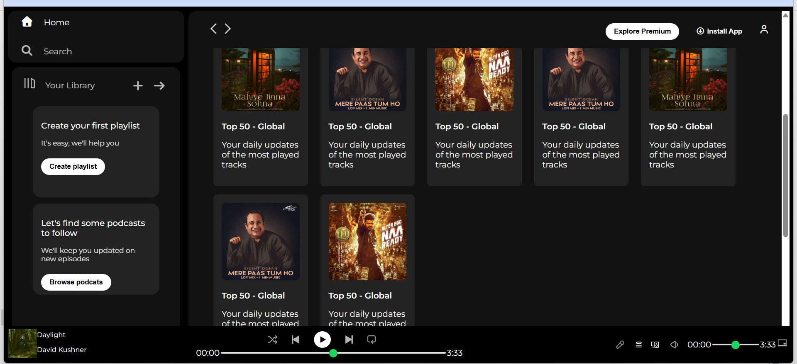
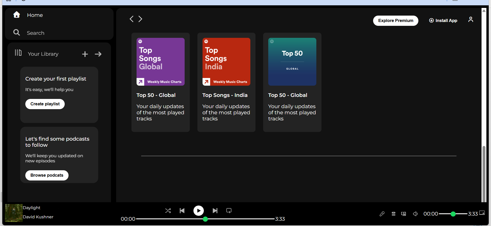

# 🎵 Spotify Web Clone

A front-end clone of the Spotify Web Player built using HTML and CSS.  
This project replicates the user interface of Spotify with a clean design, responsive layout, and modern styling.

## 🚀 Live Demo
(Add your GitHub Pages link here)

---

## 🛠️ Technologies Used
- HTML5  
- CSS3  
- Google Fonts  
- Font Awesome Icons  

---

## ✨ Features
- Spotify-like modern UI
- Sidebar navigation (Home, Search, Library)
- Music cards and playlists section
- Bottom music player UI
- Responsive layout for different screen sizes
- Clean and well-structured code

---

## 📁 Project Structure
📦 spotify-web-clone
┣ 📂 Projimg
┃ ┣ 🎵 album icons & images
┣ 📄 MiniProject.html
┣ 📄 MiniProject.css

---

## 📸 Screenshots

### Home Page

### Playlist Section

### Music Player

---

## 👩‍💻 Author
**Archana Ingle**  
- GitHub: https://github.com/archanaingle03  

---

## 📌 Purpose
This project is created for learning and practice purposes to improve front-end development skills and understand UI cloning using HTML and CSS.

---

⭐ If you like this project, don’t forget to give it a star!

